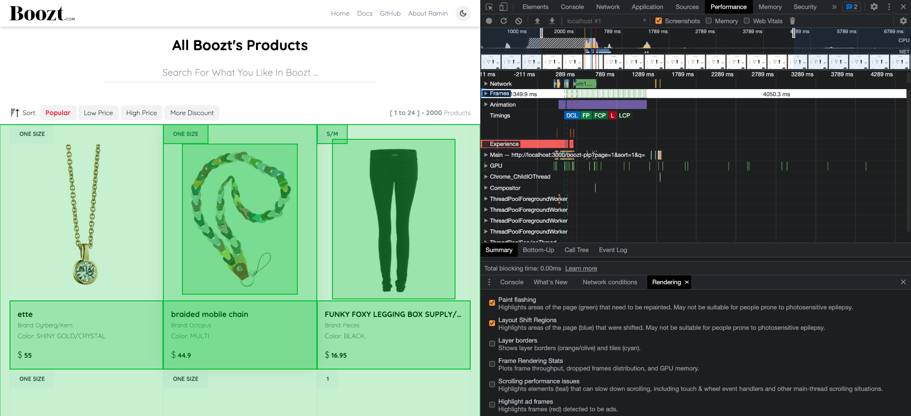
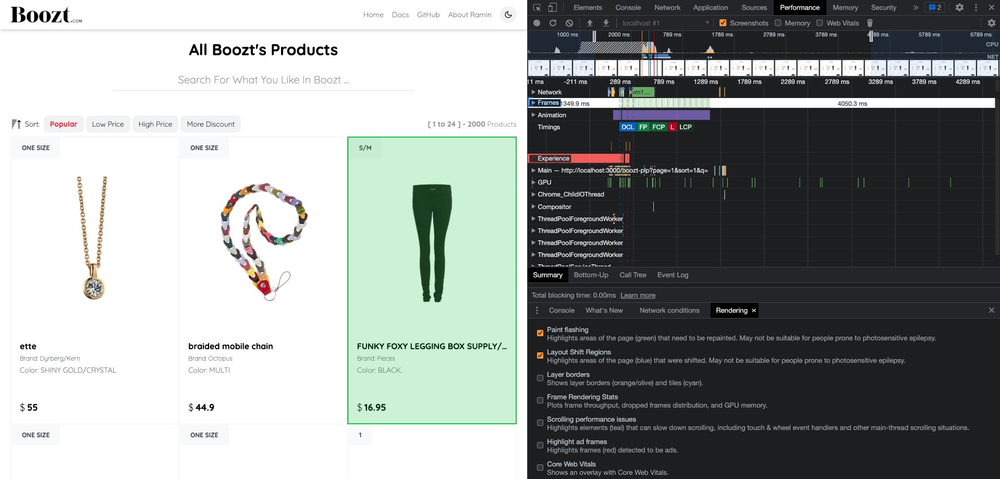
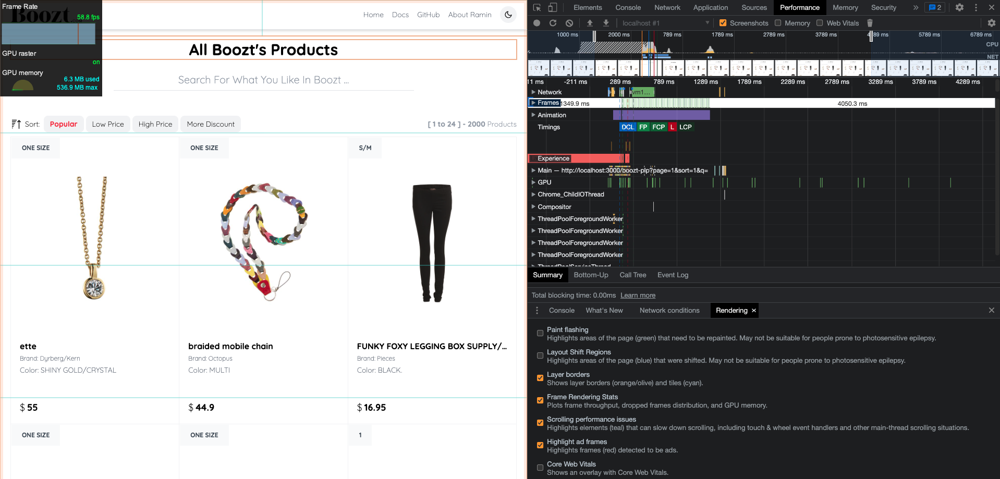
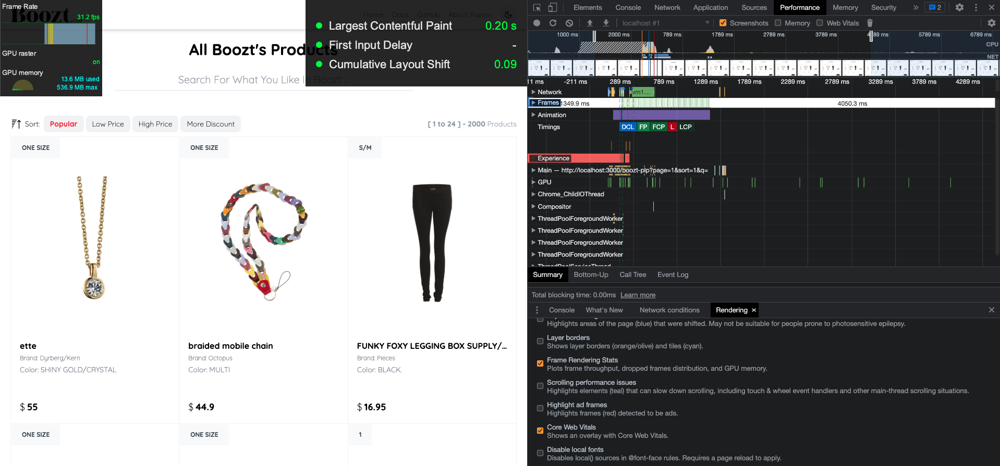
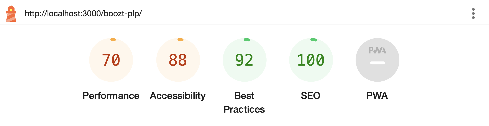
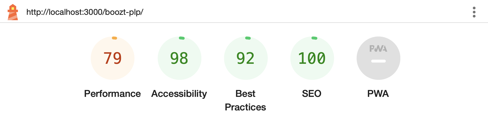
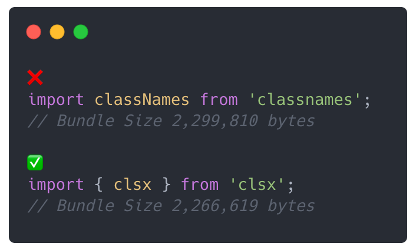
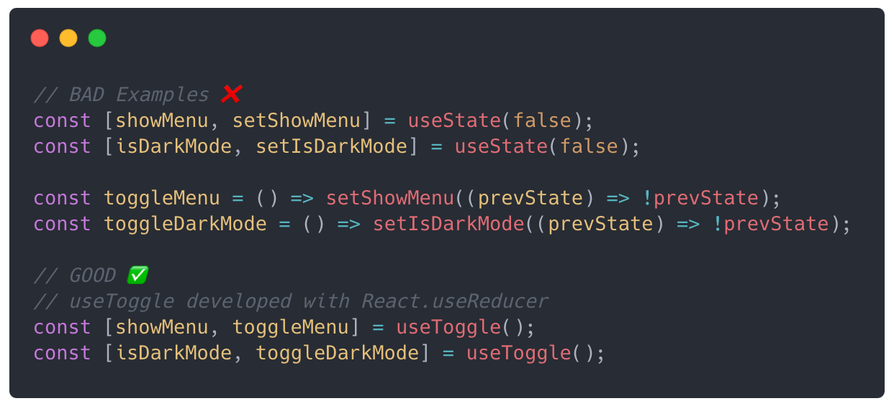
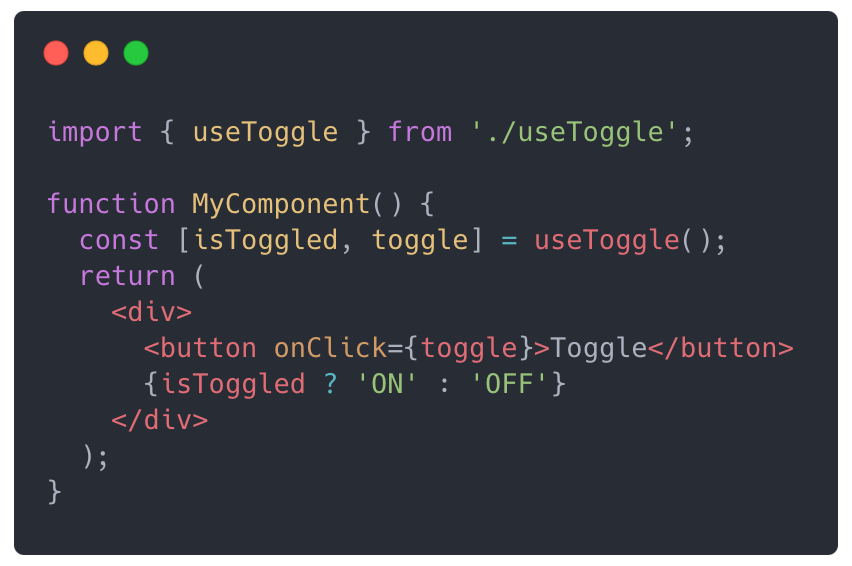

# Documents

## Intro

This project is proudly done by Ramin Rezaei as a technical task to evaluate the technical skills of a front-end developer for Boozt company (Senior Front-end Engineer - WebShop). The project has been developed as a full stack, encompassing both the front-end and back-end sections. The aim was to deliver high-quality results within a short timeframe, while showcasing strong programming skills. Notably, no external tools were utilized in any parts of the project to demonstrate proficiency in custom-built solutions. Although libraries like React-Query could have been employed for structuring requests on the front-end side, this project opted for custom hooks and request structures.

## Folder Structure

The project follows a feature-sliced design for organizing folders and files. While this structure may initially appear confusing or inadequate, it was chosen to showcase the ability to create well-structured systems for large-scale projects, including yours.

For more details on feature-sliced design, refer to the following resource:

- [Feature-Sliced Design](https://feature-sliced.design/)

## Performance

To ensure optimal performance and deliver an excellent user experience, various tools and techniques were employed in this project. Lighthouse, Performance Tab, Rendering Check, and other similar tools were utilized to fine-tune performance parameters. While considerations such as security (HTTPS) were outside the scope of this task, efforts were made to minimize browser re-rendering and re-painting during request handling and data display. Additionally, no unnecessary requests were generated. Caching data or leveraging libraries like React Query could further reduce the number of requests, making it even more optimized for high-traffic scenarios. Furthermore, utilizing client-side capabilities such as Back/Forward cache would have a significant impact on performance. Google fonts were used to enhance font download speed, and their highest quality was ensured through CDN. Although there are additional techniques for optimizing fonts, they were not required for this task. Feel free to explore them for further optimization.

Learn more about optimizing Google fonts:

- [Making Google Fonts Faster](https://sia.codes/posts/making-google-fonts-faster/)

 

Lighthouse statistics were used to improve Cumulative Layout Shift (CLS) and overall optimization. Initially, the shadow effect was considered for product cards, but upon analyzing the statistics, the design was adjusted to ensure the best re-rendering, re-painting, and alignment of elements within the browser.

Learn more about optimizing CSS box-shadow animation performance and CLS:

- [CSS Box Shadow Animation Performance](https://www.sitepoint.com/css-box-shadow-animation-performance/)
- [Optimize CLS (Cumulative Layout Shift)](https://web.dev/optimize-cls/)

### Core Web Vitals & Layer Border

Enhancing Core Web Vitals and implementing layer borders can significantly improve the user experience and make your website visually appealing.

 
Improving performance and accessibility scores in Lighthouse audits can greatly enhance the overall user experience and ensure that your website meets modern standards.
 

[classnames] and [clsx] are both utility libraries that assist in conditionally joining CSS class names together. They are commonly used in React projects to dynamically apply classes based on different conditions or states. The [classnames] library is a popular choice for this task, but it may contribute to a larger bundle size due to its dependencies and code footprint. On the other hand, [clsx] is a lightweight alternative that aims to provide a similar functionality with a smaller footprint, making it more suitable for optimizing bundle size.

The code provided demonstrates the development of a custom hook called useToggle that utilizes the useReducer hook from React. This custom hook aims to optimize binary mode functionality and serves as a replacement for the standard useState hook. The useToggle hook accepts an optional initialValue parameter, defaulting to false if not provided. Internally, it employs the useReducer hook to manage the state. The toggler function acts as the reducer function responsible for updating the state based on dispatched actions. It takes two parameters: currentValue, representing the current state value, and newValue, the value passed when dispatching an action. If newValue is explicitly of type boolean, it returns that value. Otherwise, it negates the currentValue, effectively toggling between true and false. By leveraging useReducer instead of useState, the useToggle hook provides a more optimized solution for managing binary mode state. It avoids unnecessary re-renders that may occur when using useState for this purpose. To utilize the useToggle hook in your components, import it from the file where it is defined and invoke it like any other custom hook. If needed, provide an optional initialValue parameter. The hook will return an array with two elements: the current state value and a function to toggle the state. Here's an example usage:

By utilizing the useToggle hook, you can easily manage binary mode state within your components, providing a clean and optimized solution for handling toggling functionality. This project also includes other types of hooks, each designed with attention to detail and optimized for performance.

## UI & UX

The implementation of this project prioritizes delivering a user interface that embodies trust and simplicity. Measures have been taken to ensure that users feel confident and at ease while interacting with the application. One notable feature is the fixed sort bar, which remains visible to the user even while scrolling through the product list. This provides easy access to sorting options at all times, enhancing the overall user experience. Additionally, a smooth transition has been implemented to automatically scroll the user back to the top of the list after changing the pagination. This subtle yet effective enhancement allows users to navigate through the product catalog seamlessly without losing their place or feeling disoriented. By considering such details, the project aims to provide a pleasant and intuitive user experience that promotes ease of use and engagement. The goal is to create an interface that fosters trust, simplicity, and seamless usability, ensuring that users can effortlessly explore and find the products they desire.

## Project Stack

- PHP
- MySql
- React
- Tailwind CSS
- SCSS Module System
- JavaScript with TypeScript

## Your Comments & Suggestions

This project was completed as a temporary employment and technical task. However, the main objective of all my projects is to learn new things and improve myself. I eagerly welcome even the smallest suggestions or ideas because I believe that thoughts are complementary. Please feel free to share your comments and suggestions in the issues section of this project on GitHub.

[Issues Page](https://github.com/raminr77/boozt-plp/issues)

## More About ...

- [See Project On GitHub](https://github.com/raminr77/boozt-plp)
- [See Or Download Full Documents On GitHub](https://github.com/raminr77/boozt-plp/tree/main/documents)
